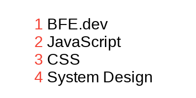
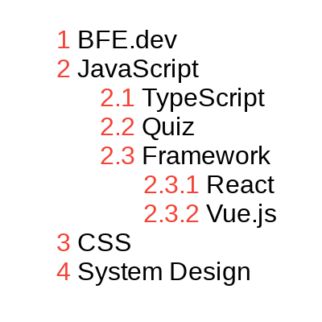

# 13. list numbering

### Problem

https://bigfrontend.dev/css/list-numbering

#

### Problem Description

Suppose we have some lists, they could be simple as

```html
<ol>
  <li>BFE.dev</li>
  <li>JavaScript</li>
  <li>CSS</li>
  <li>System Design</li>
</ol>
```

or nested.

```html
<ol>
  <li>BFE.dev</li>
  <li>
    JavaScript
    <ol>
      <li>TypeScript</li>
      <li>Quiz</li>
      <li>
        Framework
        <ol>
          <li>React</li>
          <li>Vue.js</li>
        </ol>
      </li>
    </ol>
  </li>
  <li>CSS</li>
  <li>System Design</li>
</ol>
```

please number the list as below, with color `#f44336` and one space between the number and content.

**1. simple list**

<kbd></kbd>

**2. nested**

<kbd></kbd>

#

### Solution

```css
ol {
  padding-left: 27px;
  list-style-type: none;

  /* Set a CSS counter called `item` */
  counter-reset: item;
}

li::before {
  /* Increment this instance of the `item` counter by 1 */
  counter-increment: item;

  /* Concatenate the values of all instances of the `item` counter,
     separated by a period
  */
  content: counters(item, '.') ' ';

  color: #f44336;
}
```

#

### Reference

[Nesting counters](https://developer.mozilla.org/en-US/docs/Web/CSS/CSS_Counter_Styles/Using_CSS_counters#nesting_counters)
