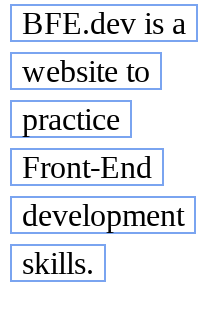
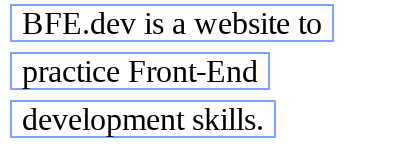

# 17. fragment style

### Problem

https://bigfrontend.dev/css/fragment-style

#

### Problem Description

Suppose we have an `<a/>` tag which is stretched to multiple lines, add borders to all its fragments.

1. color `#7aa4f0` with `1px` thickness.
2. add `5px` padding horizontally for each line.

```html
<a class="border">
  BFE.dev is a website to practice Front-End development skills.
</a>
```

**1. width:100px**

<kbd></kbd>

**2. width:200px**

<kbd></kbd>

**3. width:500px**

<kbd></kbd>

#

### Solution

```css
.border {
  line-height: 1.5;
  margin: 5px;
  padding: 0 5px;
  border: 1px solid #7aa4f0;

  box-decoration-break: clone;
  -webkit-box-decoration-break: clone;
}
```

### Explanation

The `box-decoration-break` property specifies how an element's fragments should be rendered when broken across multiple lines. It accepts two values: `slice` and `clone`. When setting it to `clone`, each fragment will be rendered independently with specified border, padding and margin wrapping each fragment.

#

### Reference

[box-decoration-break](https://developer.mozilla.org/en-US/docs/Web/CSS/box-decoration-break)
