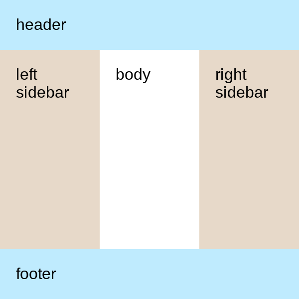
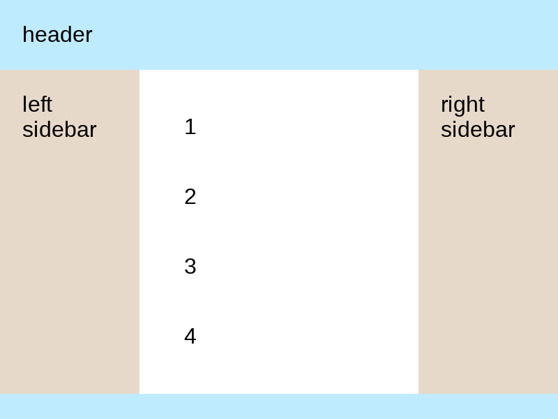
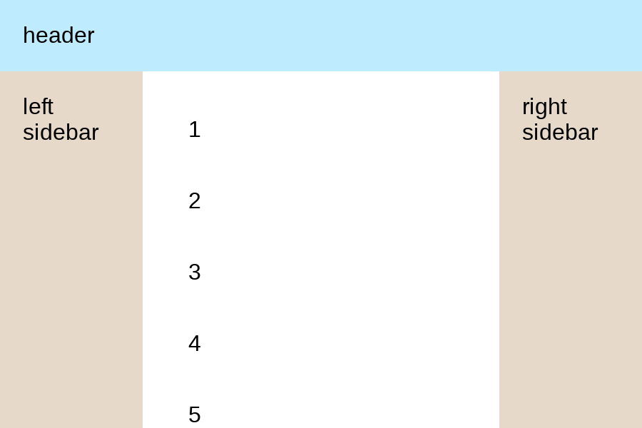

# 21. Holy Grail Layout

### Problem

https://bigfrontend.dev/css/Holy-Grail-Layout

#

### Problem Description

Implement Holy Grail Layout which includes header, left sidebar, body, right sidebar and footer.

1. it should be [sticky footer](https://bigfrontend.dev/css/sticky-footer)
2. left sidebar and right sidebar should be fixed width of 100px.
3. styles of color .etc are already set for you, only layout related CSS code is needed.

```html
<div class="container">
  <header class="header">header</header>
  <div class="left-sidebar">left sidebar</div>
  <div class="body">body</div>
  <div class="right-sidebar">right sidebar</div>
  <footer class="footer">footer</footer>
</div>
```

**1. footer sticks to bottom if content is short**

<kbd></kbd>

**2. otherwise footer is displayed as normal**

<kbd></kbd>

**3. event be pushed out from viewport if enough content**

<kbd></kbd>

#

### Solution

```css
.container {
  min-height: 100%;
  display: grid;
  grid-template-areas:
    'header header header'
    'left body right'
    'footer footer footer';
  grid-template-columns: 100px 1fr 100px;
  grid-template-rows: auto 1fr auto;
}

.header {
  grid-area: header;
}

.left-sidebar {
  grid-area: left;
}

.body {
  grid-area: body;
}

.right-sidebar {
  grid-area: right;
}

.footer {
  grid-area: footer;
}
```

### Explanation

To make the footer sticky, we set `min-height` of the `.container` to `100%` and its `grid-template-rows` to `auto 1fr auto`. When the browser renders our grid, first it calculates the necessary space that the `auto` items need, then it distributes the remaining space to all the `fr` elements according to the amount they requested. The `fr` unit represents a fraction of the available space and `1fr` means one fraction of the available space. Since there are no other `fr` elements in our grid container, the second row will take up all the available space.

#

### Reference

[How is "grid-template-rows: auto auto 1fr auto" interpreted?](https://stackoverflow.com/questions/49145552/how-is-grid-template-rows-auto-auto-1fr-auto-interpreted)
