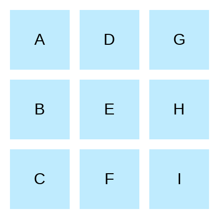

# 22. Grid Layout 1

### Problem

https://bigfrontend.dev/css/grid-layout-1

#

### Problem Description

Layout a 3x3 grid and place `A` to `I` in column-first order.

1. set gap in rows and columns of `10px`.
2. container size is already set.

```html
<div class="container">
  <div class="item a">A</div>
  <div class="item b">B</div>
  <div class="item c">C</div>
  <div class="item d">D</div>
  <div class="item e">E</div>
  <div class="item f">F</div>
  <div class="item g">G</div>
  <div class="item h">H</div>
  <div class="item i">I</div>
</div>
```

**200x200**

<kbd></kbd>

#

### Solution

```css
.container {
  display: grid;
  grid-template-rows: repeat(3, 1fr);
  grid-auto-flow: column;
  gap: 10px;
}

.item {
  display: grid;
  place-items: center;
  background-color: #bfebfe;
}
```

### Explanation

The `grid-auto-flow` property specifies how auto-placed items get flowed into the grid. With the `grid-template-rows` property being defined, setting `grid-auto-flow` to `column` makes the grid items flow in a vertical direction and new columns are automatically created if necessary.

The `place-items` property is a shorthand for `align-items` and `justify-items` combined.

#

### Reference

- [Auto-placement in CSS Grid Layout](https://developer.mozilla.org/en-US/docs/Web/CSS/CSS_Grid_Layout/Auto-placement_in_CSS_Grid_Layout)

- [grid-auto-flow](https://developer.mozilla.org/en-US/docs/Web/CSS/grid-auto-flow)

- [place-items](https://developer.mozilla.org/en-US/docs/Web/CSS/place-items)
