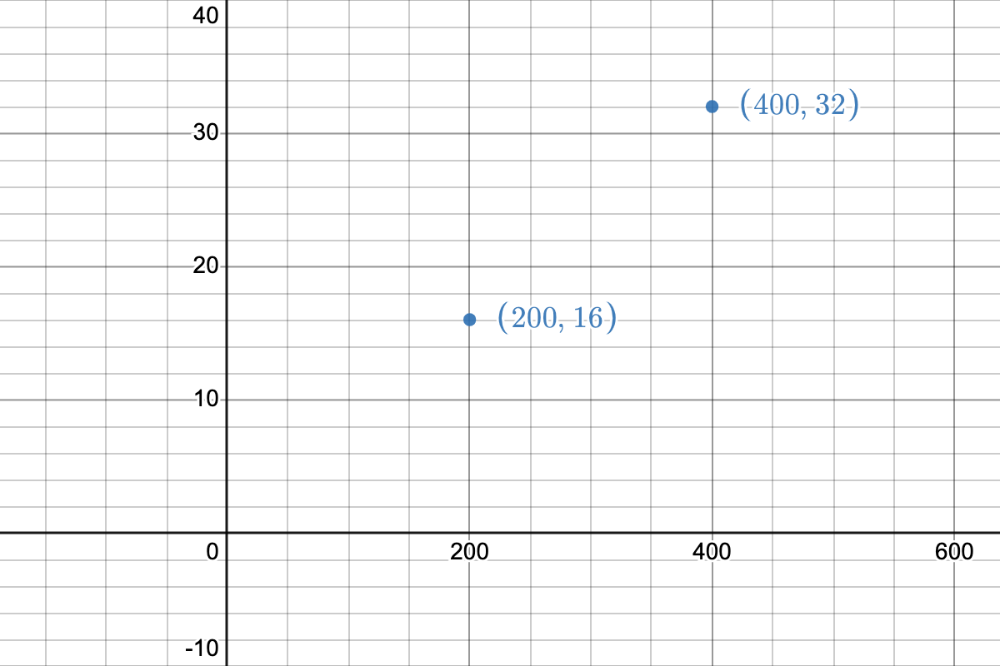
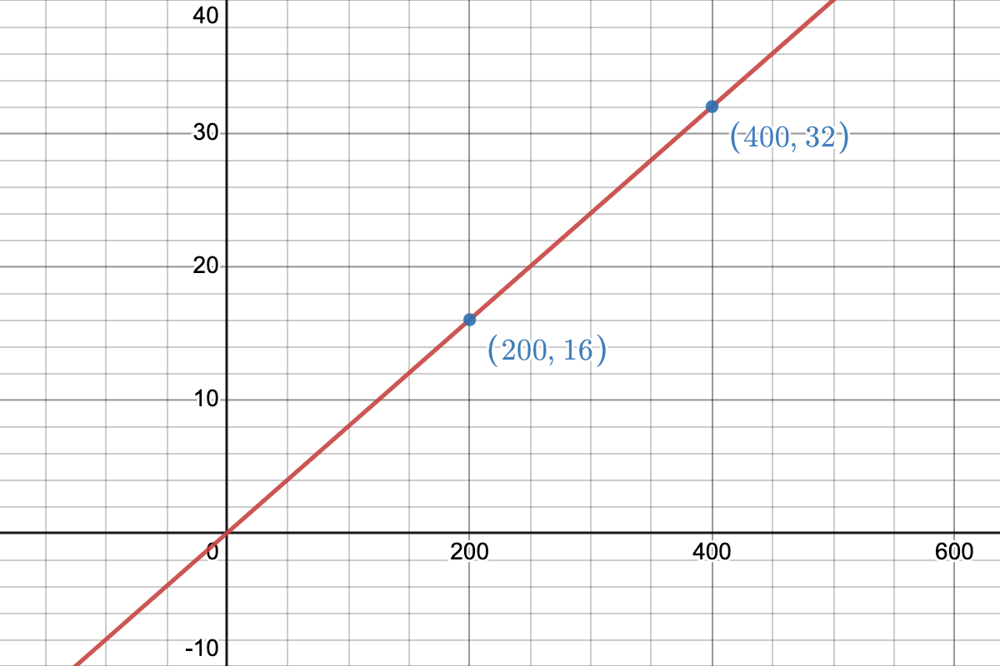

# 24. fluid font size

### Problem

https://bigfrontend.dev/css/fluid-font-size

#

### Problem Description

Create a heading of fluid font size.

1. if viewport width is smaller than 200px, use 16px
2. if viewport width is bigger than 400px, use 32px
3. otherwise font-size is linearly scaled. For example if viewport is 300px = (200px + 400px) / 2, then font-size is 24px = (16px + 32px) / 2

```html
<h1 class="title">BFE.dev</h1>
```

**1. 100px**

<kbd></kbd>

**2. 150px**

<kbd></kbd>

**3. 200px**

<kbd></kbd>

**4. 219px**

<kbd></kbd>

**5. 252px**

<kbd></kbd>

**6. 300px**

<kbd></kbd>

**7. 379px**

<kbd></kbd>

**8. 400px**

<kbd></kbd>

**9. 500px**

<kbd></kbd>

#

### Solution

```css
.title {
  text-align: center;
  font-size: clamp(16px, 8vw, 32px);
}
```

### Explanation

We probably think that we could make use of the equations in the problem statement to scale the font size linearly when viewport width is between 200px and 400px. Combining the two equations, we can get:

```
fontSize = (16px + 32px) / ((200px + 400px) / viewportWidth)
```

Then we could use this equation for `calc()`:

```css
.title {
  font-size: calc((16px + 32px) / ((200px + 400px) / 100vw));
}
```

However, in `calc()` [division (/) requires the right-hand side to be unitless](https://developer.mozilla.org/en-US/docs/Web/CSS/calc#syntax). Thus we need a different formula for the font size.

Let's pair the viewport width and the font size together and plot them on an X and Y coordinate system, where the X axis indicates the viewport width and the Y axis indicates the font size:

<kbd></kbd>

Since the font size is scaled linearly between 200px and 400px, we can draw a secant line between the two points:

<kbd></kbd>

So the formula for the font size is:

```
fontSize = slope * (viewportWidth - 200) + 16
```

The value of the slope is `(y2 - y1) / (x2 - x1) = (32 - 16) / (400 - 200) = 0.08`. Substitute it into the formula, we get:

```
fontSize = 0.08 * (viewportWidth - 200) + 16
         = 0.08 * viewportWidth - 16 + 16
         = 0.08 * viewportWidth
         = 0.08 * 100vw
         = 8vw
```

So our solution is:

```css
.title {
  text-align: center;
  font-size: 8vw;
}

@media (max-width: 200px) {
  .title {
    font-size: 16px;
  }
}

@media (min-width: 400px) {
  .title {
    font-size: 32px;
  }
}
```

We can get rid of the media queries by using the `clamp()` function, which clamps a value between an upper and lower bound. Therefore, the final solution is:

```css
.title {
  text-align: center;
  font-size: clamp(16px, 8vw, 32px);
}
```

#

### Reference

[Linearly Scale font-size with CSS clamp() Based on the Viewport](https://css-tricks.com/linearly-scale-font-size-with-css-clamp-based-on-the-viewport/)
