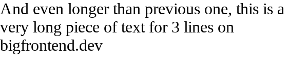
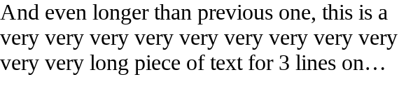

# 3. truncate text in multiple lines(with ellipsis)

### Problem

https://bigfrontend.dev/css/truncate-text-in-multiple-lines-with-ellipsis

#

### Problem Description

Just like [2. truncate text in one line(with ellipsis)](https://bigfrontend.dev/css/truncate-text-with-ellipsis-in-one-line), please do the same for max 3 lines.

**1. short text(1 line)**

<kbd></kbd>

**2. short text (2 lines)**

<kbd></kbd>

**3. 3 lines(no overflow)**

<kbd></kbd>

**4. more than 3 lines**

<kbd></kbd>

#

### Solution

```css
.max-three-lines {
  /* your code here */
  display: -webkit-box;
  overflow: hidden;
  -webkit-box-orient: vertical;
  -webkit-line-clamp: 3;
}
```
