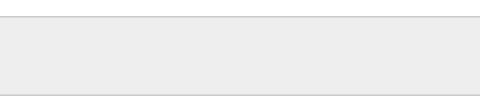
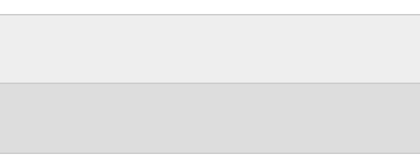
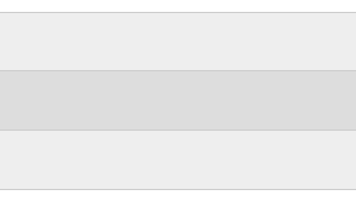

# 7. a row

### Problem

https://bigfrontend.dev/css/nth-child

#

### Problem Description

Suppose we have a row structured as below:

```html
<div class="row"></div>
```

Please complete the CSS according to following requirements:

1. height 50px
2. set background to `#eee`, but if there are adjacent rows, set even rows' background to `#ddd`
3. set 1px border on top & bottom with color `#ccc`, but if there are adjacent rows, adjacent borders should be collapsed into one

> if you have to decide which row to display both top and bottom border, add it to first row, [ref](https://bigfrontend.dev/css/7/discuss/8065?focus=8082)

**1. one row**

<kbd></kbd>

**2. two rows**

<kbd></kbd>

**3. three rows**

<kbd></kbd>

#

### Solution

```css
:root {
  --border-color: #ccc;
}

.row {
  height: 50px;
  border-bottom: 1px solid var(--border-color);
}

.row:first-child {
  border-top: 1px solid var(--border-color);
}

.row:nth-child(odd) {
  background: #eee;
}

.row:nth-child(even) {
  background: #ddd;
}
```
