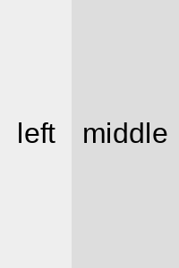
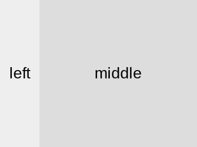
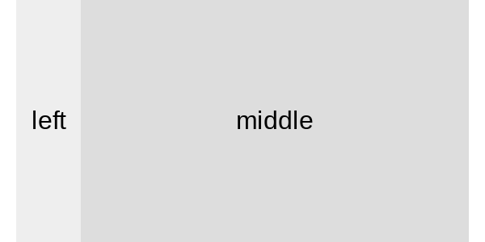
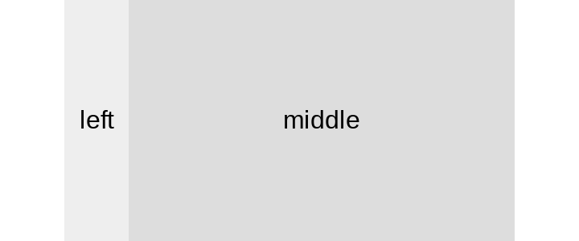
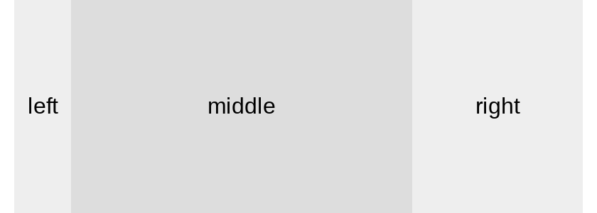
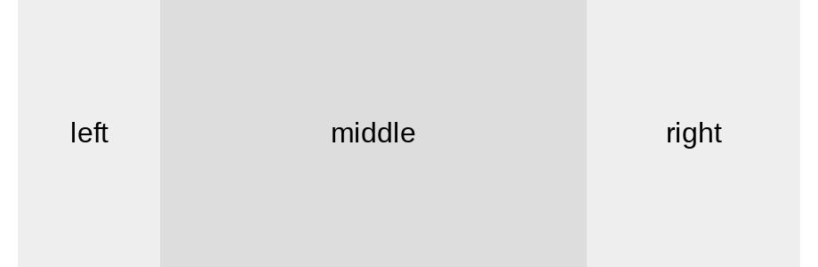
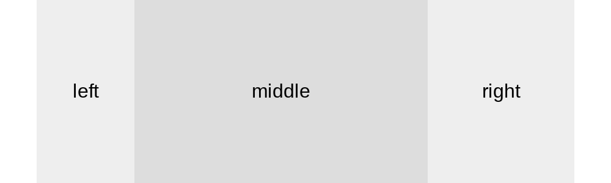

# 8. Twitter's website layout

### Problem

https://bigfrontend.dev/css/twitter-layout

#

### Problem Description

Open Twitter's website and change the window size, you'll notice that layout changes responsively.

Let's do something similar in this problem, suppose we have HTML structure as below.

```html
<div class="container">
  <div class="left">left</div>
  <div class="middle">middle</div>
  <div class="right">right</div>
</div>
```

Now please complete the CSS to satisfy following requirement

1. when viewport width is not enough, set left column to 40px wide and middle column to stretching.
2. middle column has maximum width of 240px
3. when there is enough space, show right column which has width of 120px
4. if there is more space, set left column to 80px
5. when right column is visible, set minimum 10px space horizontally to the viewport border

It is a bit hard to explain clearly, but following screenshots might be easier to understand.

**1. 100 x 150**



**2. 200 x 150**



**3. 300 x 150**

<kbd></kbd>

**4. 360 x 150**

<kbd></kbd>

**5. 400 x 150**

<kbd></kbd>

**6. 420 x 150**

<kbd></kbd>

**7. 460 x 150**

<kbd></kbd>

**8. 500 x 150**

<kbd></kbd>

#

### Solution

```css
.container {
  display: flex;
  justify-content: center;
  height: 150px;
}

.left {
  width: 40px;
  background-color: #eee;
}

.middle {
  width: 240px;
  max-width: calc(100% - 40px);
  background-color: #ddd;
}

.left,
.middle {
  display: flex;
  align-items: center;
  justify-content: center;
}

.right {
  display: none;
  width: 120px;
  background-color: #eee;
}

@media (min-width: 420px) {
  .container {
    padding: 0 10px;
  }

  .right {
    display: flex;
    align-items: center;
    justify-content: center;
  }
}

@media (min-width: 460px) {
  .left {
    width: 80px;
  }
}
```
