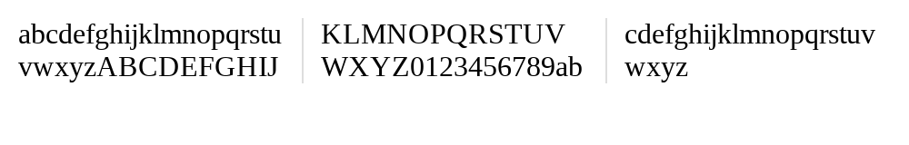

# 9. multi-column text

### Problem

https://bigfrontend.dev/css/multi-column-text

#

### Problem Description

It is very common to see text in multiple columns on newspaper, please achieve something similar in this problem.

Suppose you have HTML structure like below.

```html
<div class="three-column-text">some very very long text</div>
```

Complete the CSS code according to following requirements

1. divide into 3 columns
2. use 1px line of `#ddd` as separator
3. adding 10px space around each column, to container border and to the separator

> The text used in test doesn't contain space but has forced line break to show padding/margin clearly.

**text in 3 columns**

<kbd></kbd>

#

### Solution

```css
.three-column-text {
  padding: 10px;
  column-count: 3;
  column-rule: 1px solid #ddd;
  column-gap: 20px;
}
```

#

### Reference

[CSS Multi-column Layout](https://developer.mozilla.org/en-US/docs/Web/CSS/CSS_Columns)
